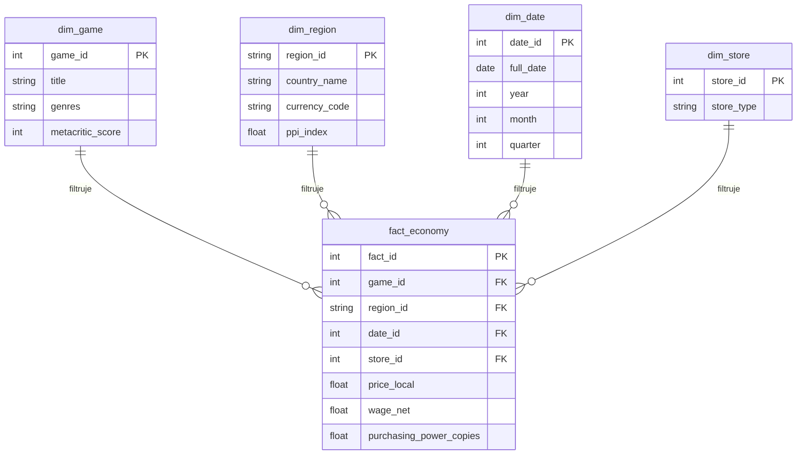
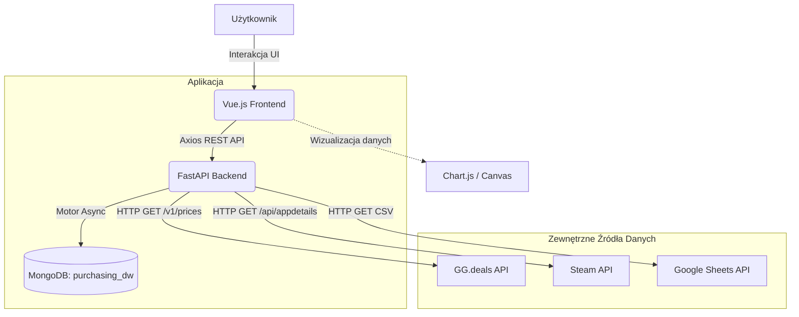

 # Price Power 🎮📊   

 ## Twórcy
Krystian Twarowski - Project Manager, Lead PR

Wiktor Kozakowski - Software Architect, Lead Fullstack Developer, Data Analist

Sebastian Mrowiński - Lead Frontend Developer

Jakub Klesiński - UI/UX Developer, Frontend Developer

Władysław Liegmanowski - Code Reviewer, Lead QA

Maciej Żelazkiewicz - Data Analist, Backend Developer

## Opis

Wielowymiarowa aplikacja analityczna służąca do porównywania siły nabywczej graczy w różnych państwach. Projekt został zrealizowany jako praktyczna implementacja koncepcji Hurtowni Danych (Data Warehouse) oraz systemów OLAP.

## 🚀 Główne funkcjonalności
* **Analiza Wielowymiarowa (OLAP Slice & Dice):** Zestawienie cen gier ze Steama (API GG.deals) z medianą i płacą minimalną w wybranych przekrojach geograficznych.
* **Bogate Wizualizacje:** Wykorzystanie zaawansowanych wykresów do prezentacji danych:
  * *Radar Chart* – Wielowymiarowy profil ekonomiczny regionu.
  * *Waffle Chart* – Wizualizacja siły nabywczej (ilość kopii gry za pensję).
  * *Doughnut Chart* – Interaktywny symulator podziału kosztów życia.
  * *Bar Chart* – Globalny benchmark i indeksowanie regionów.
  * *Line Chart* – Historyczna analiza szeregów czasowych (Time-Series) 2019-2024.
* **Integracja Steam API:** Pobieranie metadanych o grach w czasie rzeczywistym (zwiastuny, liczba aktywnych graczy, oceny Metacritic, gatunki).
* **Asynchroniczna Hurtownia Danych:** Zapisywanie faktów analitycznych w bazie MongoDB z zachowaniem pełnej ciągłości działania aplikacji (Non-blocking I/O) nawet przy braku połączenia z klastrem bazy danych.
* **Nowoczesny UX/UI:** Responsywny interfejs zbudowany w oparciu o Vuetify 3 z dynamicznym oświetleniem, maskowaniem wektorowym SVG oraz interaktywnym tłem cząsteczkowym (Plexus).

## 🛠 Technologie
### Frontend
* Vue 3 (Composition API)
* TypeScript
* Vuetify 3 (Material Design)
* Chart.js + vue-chartjs
* Axios
* Vite

### Backend
* Python 3.12
* FastAPI
* Motor (Asynchroniczny sterownik MongoDB)
* Uvicorn

### Baza Danych / OLAP
* MongoDB (Architektura pod hurtownię danych)

## 🏗 Architektura Hurtowni Danych
Aplikacja mapuje klasyczne zagadnienia modelowania wielowymiarowego:
* **Tabela Faktów (`fact_economy`):** Przechowuje wyliczone miary (cena w regionie 1, cena w regionie 2, wyliczona ilość kopii, różnice walutowe).
* **Wymiary (Dimensions):** `Dim_Game` (gra, gatunek), `Dim_Region` (kraj, waluta), `Dim_Time` (data zapytania i analizy).
* **Kostka OLAP:** Możliwość filtrowania danych przez konkretny tytuł i porównywania dowolnych par regionów względem zarobków minimalnych i średnich.
 
## ⚙️ Uruchomienie projektu

### Wymagania wstępne
* Node.js (wersja 18+)
* Python 3.10+
* Docker (do lokalnej bazy danych)

## ⚙️ Wykresy

```mermaid
sequenceDiagram
    actor U as Użytkownik
    participant F as Vue.js (Frontend)
    participant B as FastAPI (Backend)
    participant DB as MongoDB
    participant GG as GG.deals API
    participant S as Steam API

    U->>F: Klika "Wykonaj Analizę"
    
    par Równoległe zapytania (Promise.all)
        F->>B: GET /api/compare
        F->>B: GET /api/dw/history
        F->>B: GET /api/dw/basket
        F->>B: GET /api/game-details
    end

    rect rgb(40, 44, 52)
    Note over B, GG: Obsługa API Compare
    B->>GG: Pobierz cenę dla Kraju 1
    GG-->>B: Cena (Klucz/Retail)
    B->>GG: Pobierz cenę dla Kraju 2
    GG-->>B: Cena (Klucz/Retail)
    B->>DB: Zapisz fakt do hurtowni (fact_economy)
    B-->>F: Odpowiedź JSON (ceny, waluty)
    end

    rect rgb(40, 44, 52)
    Note over B, S: Obsługa API Steam
    B->>S: Pobierz detale aplikacji (sklep)
    S-->>B: Dane o grze (zwiastun, opis)
    B->>S: Pobierz statystyki graczy
    S-->>B: Aktywni gracze
    B-->>F: Odpowiedź JSON ze szczegółami
    end

    F->>F: Przeliczenie walut na docelowe (Frontend)
    F->>F: Przeliczenie indeksów PPI i wielkości słupków
    F->>U: Renderowanie wykresów i animacji
```

